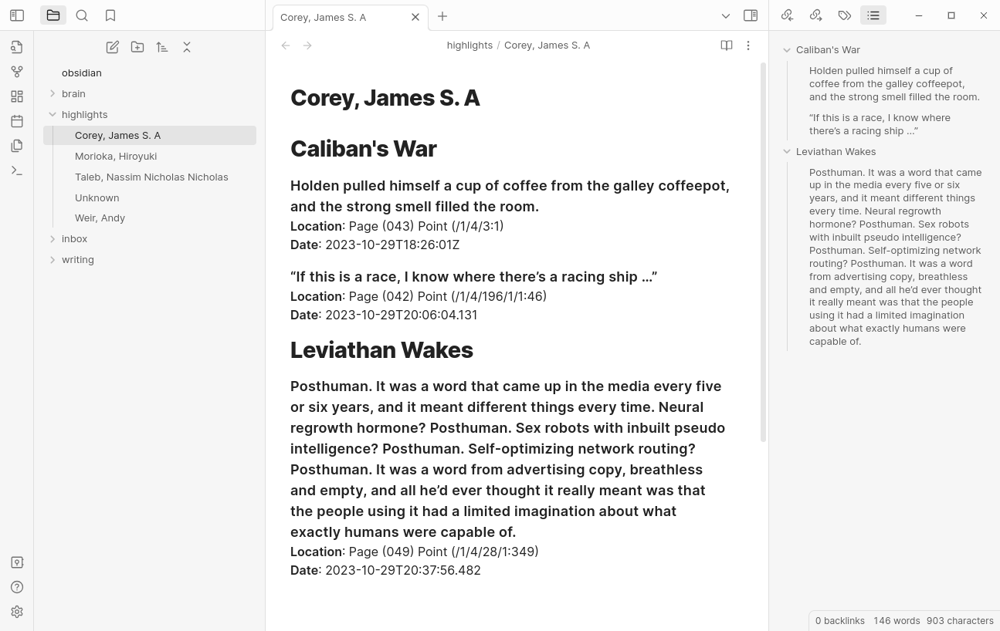
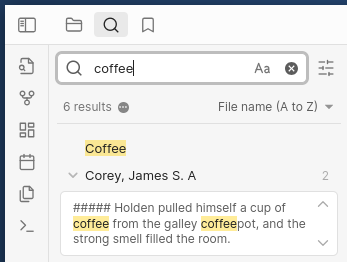

# Kobo Highlights to Obsidian (markdown)

This program reads highlights directly from a Kobo e-reader and exports them into an Obsidian vault. It uses Python and the SQLite3 library to connect to the Kobo database and retrieve the highlights, and then saves them to a Markdown file in the Obsidian vault.



## What is Kobo (e-reader)?

A Kobo e-reader is more open than an amazon kindle, supporing epub, custom configuration settings, and easy read of sqlite database of bookmarks and collections under `device\.kobo\KoboReader.sqlite`

## What is Obsidian (note-taking - knowledge-base) ?

[Obsidian](https://obsidian.md/) is a mardown text editor like [Typora](https://typora.io/) that works great for note-taking - allowing you to link between notes and search.



## What is your second brain?

If you're like me, you probably take a lot of notes but they get thrown away - lost in paper notebooks or disorganized text files.

*Second brain* is really just a concept of aggreating that in a seachable way. [Obsidian](https://obsidian.md/) (or any text editor with folders or wiki) makes it easy to organize notes so you wind up with a file-sized repository of details at your disposal. Combine it with a conceptual productivity system like [PARA](https://fortelabs.com/blog/para/) (Project, Area, Resource, Archive) and you might find it transformative.

This project really isn't about *second brain* however it is about adding your reading highlights into [Obsidian](https://obsidian.md/), so it is searchable within your *second brain* vault.

A good intro to the concept is this video by [Matt D'Avella -  I learned a productivity system for organizing life ](https://www.youtube.com/watch?v=0_44XEVOwek) or [Building a Second Brain by Tiago Forte](https://www.overdrive.com/media/8033824/building-a-second-brain)

## Dependencies

- Python 3.x
- SQLite3 library

## Setup

1. Clone the repository to your local machine.
2. Install Python and the SQLite3 library if you haven't already.
3. Open the `settings.json` file and update the `kobo_path` and `obsidian_path` variables to match the paths to your Kobo device and Obsidian vault, respectively.

```json
{
    "kobo_path": "/Volumes/KOBOeReader/.kobo/KoboReader.sqlite",
    "obsidian_path": "/Users/username/Documents/Obsidian/Vault"
}
```
## Usage
1. Connect your Kobo device to your computer and mount it as a drive.
Open a terminal window and navigate to the root directory of the project.
1. Run the kobo_to_obsidian.py script using the following command:
1. The program will retrieve the highlights from the Kobo database and save them to a Markdown file in the Obsidian vault. The file will be named after the author of the book and will be located in the root directory of the vault.
```bash
python kobo_to_obsidian.py
```
4. The program will retrieve the highlights from the Kobo database and save them to a Markdown file in the Obsidian vault. The file will be named after the author of the book and will be located in the root directory of the vault.

## Troubleshooting
- If you encounter any errors while running the program, make sure that the paths in the settings.json file are correct and that your Kobo device is mounted as a drive.
- If you have trouble connecting to the Kobo database, try restarting your computer or disconnecting and reconnecting the device.
- If you have trouble exporting the highlights to the Obsidian vault, make sure that the path to the vault is correct and that you have write permissions for the directory.

## Sample Output

> /home/chris/obsidian/highlights/Corey, James S. A.md

# Caliban's War
##### Holden pulled himself a cup of coffee from the galley coffeepot, and the strong smell filled the room.
**Location**: Page (043) Point (/1/4/3:1)
**Date**: 2023-10-29T18:26:01Z
##### “If this is a race, I know where there’s a racing ship …”
**Location**: Page (042) Point (/1/4/196/1/1:46)
**Date**: 2023-10-29T20:06:04.131
# Leviathan Wakes
##### Posthuman. It was a word that came up in the media every five or six years, and it meant different things every time. Neural regrowth hormone? Posthuman. Sex robots with inbuilt pseudo intelligence? Posthuman. Self-optimizing network routing? Posthuman. It was a word from advertising copy, breathless and empty, and all he’d ever thought it really meant was that the people using it had a limited imagination about what exactly humans were capable of.
**Location**: Page (049) Point (/1/4/28/1:349)
**Date**: 2023-10-29T20:37:56.482
